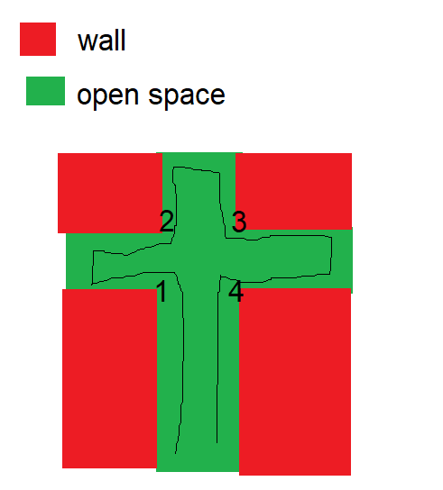

# Terminology
`N` is an integer representing the size of the square grid.

`grid` represents the _N_ by _N_ grid.

The grid will contain various numbers representing the states of the respective cells in the grid, corresponding to the following legend:

- 0 = open space
- 1 = wall
- 2 = visited space
- 3 = current position

# Explanation
This algorithm uses a modified BFS (Breadth-First Search) which keeps track of which direction the "robot" is facing. With every move, it checks if the space to the left of the direction it is facing is open; if it is, it will turn left and update the direction it is facing (-90 degrees). Otherwise, it will go straight towards the direction it is facing. 

Similar to a regular BFS, the robot will keep track of spaces it has previously visited. However, instead of using just `true` or `false`, it instead will count _how many times_ it has passed through that space. It is done this way due to the fact that the robot can traverse the same space multiple times. Yet, it may only do so a total of four times:



Thus, if a space is visited more than four times, we know that a loop has been reached and the maze is therefore unsolvable.

# Pseudocode

```
queue := []                  //create the queue for the graph traversal
visited[N][N] := 0           //N by N visited array, with each value in the array initialized to 0
queue.insert(0,0)            //starting coordinates
visited[0][0] = 1            //visited starting coord once

facing := 0
//left  = 0
//up    = 90
//right = 180
//down  = 270

status := ""

while queue is not empty:
    x, y := queue[0]
    queue.pop()
```


